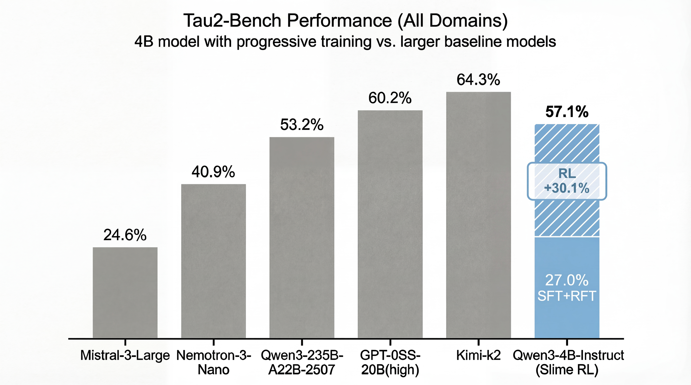
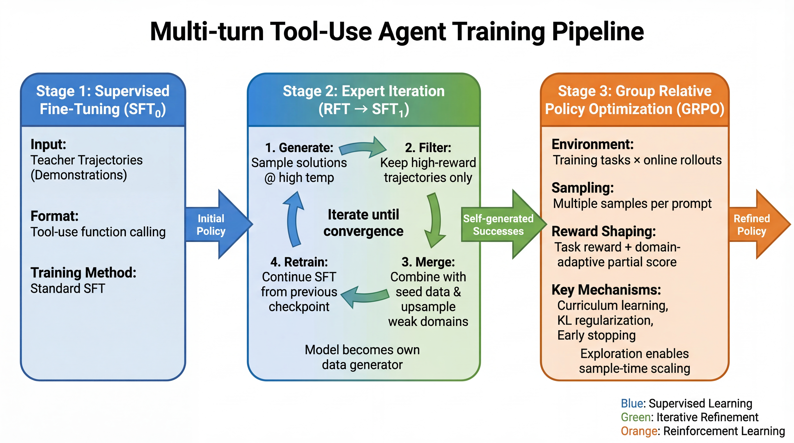

# Training Multi-Turn Tool-Use Agents with GRPO

[](https://huggingface.co/Jarrodbarnes/Qwen3-4B-tau2-grpo-v1)
[](https://huggingface.co/datasets/Jarrodbarnes/tau2-sft-seed-v3)
[](LICENSE)

A 4B parameter model achieving **57.1% Pass@4** on tau2-bench (test split), 4x better than the base model and competitive with models 6-60x larger.

<p align="center">
  
</p>

<p align="center">
  
</p>

*Three-stage training pipeline (SFT -> rejection sampling -> GRPO) for multi-turn tool-use agents.*

Everything is open source: [training data](https://huggingface.co/datasets/Jarrodbarnes/tau2-sft-seed-v3), [checkpoints](https://huggingface.co/Jarrodbarnes/Qwen3-4B-tau2-grpo-v1), and this repository.

---

## Credit Assignment in Multi-Turn Tool-Use

In a telecom troubleshooting task, the agent guides a user through 20+ turns of diagnostics before solving their MMS issue. At step 15, the agent asks the user to grant app permissions, a critical action. But the final reward only arrives at step 20.

How does the model know step 15 mattered?

Standard outcome-based rewards (0/1) provide essentially zero gradient across intermediate steps. The model sees no signal until task completion. For complex tool-use, this is catastrophic. Early SFT attempts achieved 8.57% on tau2-bench, which is actually *worse* than the unprompted baseline of 14.3%.

## Method

### Stage 1: SFT (Teaching Protocol)

Before a model can *optimize* tool-use, it must understand the rules:

1. **Turn structure**: One action per turn, wait for environment response
2. **Tool schemas**: 30+ tools across domains with complex argument structures
3. **Dual-control**: In telecom, the agent coaches users through diagnostics rather than executing them

Without SFT, RL training thrashes. With SFT on filtered trajectories, we reach 27% on test, which gives the model enough competence to explore productively.

### Stage 2: Rejection Sampling (RFT)

After SFT, the model can complete tasks but inconsistently. Sampling multiple rollouts and keeping only successes concentrates the training distribution on viable strategies:

1. Sample 4-8 attempts per task at temperature 0.8
2. Keep trajectories where `reward >= 1.0`
3. For tasks with no successes, keep highest `partial_score` if >= 0.6

The published [tau2-sft-seed-v3](https://huggingface.co/datasets/Jarrodbarnes/tau2-sft-seed-v3) dataset results from this filtering.

### Stage 3: GRPO + Turn-Level Reward Shaping

GRPO solves credit assignment through two mechanisms:

**Group-based advantage estimation**: For each prompt, sample K trajectories, score them, and train the model to increase probability of high-reward actions relative to the group average. The model learns "this action was better than my other attempts" rather than "this action is good in absolute terms."

**Dense reward shaping**: Tau2-bench provides turn-level evaluation (action checks, communication checks, environment assertions). We extract partial scores and shape rewards:

```python
shaped_reward = task_reward + alpha * partial_score
```

This provides gradient at every turn, not just at task completion.

## Results

| Stage | Overall | Airline | Retail | Telecom |
|-------------------------------|---------|---------|--------|---------|
| Baseline (Qwen3-4B-Instruct) | 14.3% | 5.0% | 16.0% | 20.0% |
| SFT | 8.57% | 5.0% | 20.0% | 0.0% |
| SFT + RFT | 27.0% | 20.0% | 50.0% | 7.5% |
| GRPO (Pass@1, greedy) | 32.9% | 15.0% | 76.0% | 4.0% |
| **GRPO (Pass@4)** | **57.1%** | **50.0%** | **76.0%** | **44.0%** |

The 24.2 percentage point gain from Pass@1 to Pass@4 shows that RL-trained models benefit from inference-time exploration. They learn multiple viable strategies instead of overfitting to one path.

[Training logs (WandB)](https://wandb.ai/jbarnes850-near-protocol/tau2-cookbook)

---

## Quick Start

All scripts use `slimerl/slime:latest` container:

```bash
docker pull slimerl/slime:latest
docker run --gpus all --rm -it \
  -v "$(pwd)":/workspace/tau2-rl-pipeline \
  -w /workspace/tau2-rl-pipeline \
  slimerl/slime:latest

# Inside container
export TAU2_ROOT=/workspace/tau2-rl-pipeline
export TAU2_OUT_DIR="${TAU2_ROOT}/outputs"
mkdir -p "${TAU2_OUT_DIR}"

# Install tau2-bench
git clone https://github.com/sierra-research/tau2-bench.git "${TAU2_OUT_DIR}/_external/tau2-bench"
cd "${TAU2_OUT_DIR}/_external/tau2-bench"
git checkout 337326e62d8e0ca74c353b004a9c5d748e0ba914
pip install -e . --no-deps
export TAU2_DATA_DIR="${TAU2_OUT_DIR}/_external/tau2-bench/data"
cd "${TAU2_ROOT}"

# Runtime dependencies
pip install gymnasium addict deepdiff fs langfuse plotly pydantic-argparse redis \
  scikit-learn seaborn tenacity watchdog "litellm==1.65.0"

# API keys (required for user simulator)
cp configs/.env.template configs/.env  # ADD OPENAI_API_KEY
set -a && source configs/.env && set +a
```

## Reproduce Pass@4

Download the [GRPO checkpoint](https://huggingface.co/Jarrodbarnes/Qwen3-4B-tau2-grpo-v1) and run evaluation:

**Terminal 1: Policy server** (use `--tp 1` on single GPU):
```bash
CUDA_VISIBLE_DEVICES=0,1 python3 -m sglang.launch_server \
  --model-path Jarrodbarnes/Qwen3-4B-tau2-grpo-v1 \
  --host 0.0.0.0 --port 30000 --tp 2 --mem-fraction-static 0.70 \
  --served-model-name qwen3-4b \
  --tool-call-parser qwen25 --reasoning-parser qwen3
```

**Terminal 2: Evaluation** (requires `OPENAI_API_KEY` for user simulator):
```bash
python3 eval/eval_passk.py \
  --sglang-url http://127.0.0.1:30000 \
  --sglang-model qwen3-4b \
  --domains airline,retail,telecom --task-split test --num-samples 4 \
  --output "${TAU2_OUT_DIR}/eval_pass4.json"
```

Takes ~2 hours on 2xH100. Results are stochastic; expect Pass@4 in the 55-60% range.
The JSON report includes a credential-redacted `configuration` block and one shared
`trajectory_context` per task (tools). Each attempt references a compact role-based
`trajectory_file`, a JSON array matching `example_trajectory.md`: its first two
`system` turns separately contain the policy and simulator prompts, followed by only
`user`, `assistant`, and `tool` turns without repeated request metadata. Assistant
text and function calls are always separate: the `content` field never contains a
native `<tool_call>` block; calls are normalized into `tool_calls`.

Every invocation groups all artifacts under a directory named after the requested
report stem. For example, `--output outputs/eval_pass4.json` creates:

```text
outputs/eval_pass4/
├── eval_pass4.json       # final aggregate report, written only when complete
├── evaluation.log        # evaluator progress and summary
├── checkpoint.json       # atomic resumability state
├── task_results/         # one atomic progress/result JSON per task
└── trajectories/         # one compact role-based JSON per sample
```

Qwen3-4B evaluation enables thinking by default and sends
`enable_thinking=true` to SGLang. Its non-greedy default sampling profile is
temperature 0.6, top-p 0.95, top-k 20, min-p 0. Its main completion and
independent format-repair budgets are both 2048 tokens, so reasoning has room
to reach an action. Use `--no-enable-thinking` for the non-thinking profile:
temperature 0.7, top-p 0.8, top-k 20, min-p 0, with 1200-token budgets.
`--max-new-tokens` and `--repair-max-new-tokens` override these independently.
Explicit sampling flags override the sampling defaults, except temperature must
remain greater than zero. The two profiles are versioned in
[`configs/qwen3-4b.yaml`](configs/qwen3-4b.yaml); select another file with
`--policy-config PATH`.

The simulator's reasoning is disabled by default. Use
`--user-enable-thinking` to enable it; for DeepSeek this sends
`reasoning_effort=high` and `extra_body.thinking.type=enabled`. Every report
records both policy and simulator thinking states, the simulator sampling
parameters, and the exact extra-body settings used. Each assistant trajectory
turn and attempt result also records `finish_reason`, usage, reasoning-content
length, and an explicit `reasoning_only` / `reasoning_only_length_truncated`
diagnostic when the model exhausts output before producing an action. Normal
customer-facing text is replayed to the policy verbatim; Tau2's internal
`respond` shim is never added to the model transcript. Any model-emitted
function absent from the current tools schema is recorded under
`invalid_tool_calls` and repaired, never executed as an environment tool.

Simulator model settings are kept in
[`configs/simulator.yaml`](configs/simulator.yaml). API endpoint and credentials
remain in the ignored tau2 `.env` file. Override the simulator settings file
with `--simulator-config PATH` when running another model configuration.

Evaluation runs up to 16 tasks concurrently by default (`--max-concurrency 16`).
Each finished sample atomically writes both its trajectory JSON and its per-task
result; each completed task also updates an atomic checkpoint. If the process is
interrupted, rerun exactly the same command with the same `--output` path:
completed tasks and already written samples are reused, and only missing samples
are evaluated. The aggregate summary and final report are calculated only after
every requested task completes.

---

## Train from Scratch

### Prerequisites

**1. Download base model and training data:**

```bash
huggingface-cli download Qwen/Qwen3-4B-Instruct-2507 \
  --local-dir "${TAU2_OUT_DIR}/models/Qwen3-4B-Instruct-2507"

mkdir -p "${TAU2_OUT_DIR}/data/sft1"
huggingface-cli download Jarrodbarnes/tau2-sft-seed-v3 \
  --local-dir "${TAU2_OUT_DIR}/data/sft1" --repo-type dataset
export TAU2_SFT_DATA_DIR="${TAU2_OUT_DIR}/data/sft1"
export SFT_DATA_JSONL="${TAU2_SFT_DATA_DIR}/tau2_sft_merged_v3_rft.jsonl"
```

**2. Convert to Megatron format:**

```bash
cd /root/slime
source scripts/models/qwen3-4B-Instruct-2507.sh
python3 tools/convert_hf_to_torch_dist.py \
  --hf-checkpoint "${TAU2_OUT_DIR}/models/Qwen3-4B-Instruct-2507" \
  --save "${TAU2_OUT_DIR}/models/Qwen3-4B-Instruct-2507_torch_dist" \
  ${MODEL_ARGS[@]}
cd "${TAU2_ROOT}"
```

### Stage 1: SFT

```bash
bash scripts/train_sft.sh
```

For a smaller debug run: `SFT_DATA_JSONL="${TAU2_SFT_DATA_DIR}/seed_sft_v3.jsonl"`

### Stage 2: GRPO

**Generate task indices:**
```bash
python3 tau2_rl_pipeline/tasks.py \
  --local_dir "${TAU2_OUT_DIR}/tasks" \
  --domains airline,retail,telecom --splits train
```

**Start user simulator** (separate terminal, distinct GPUs):
```bash
GPUS=2,3 bash scripts/start_user_sim.sh
```

**Run GRPO:**
```bash
CUDA_VISIBLE_DEVICES=0,1 NUM_GPUS=2 bash scripts/train_grpo.sh
```

Training takes ~2 hours on 8xH100s.

---

## Implementation Details

**Dual-control (telecom)**: Diagnostic actions are user-only. The agent instructs rather than executes:
```
Agent: "Please toggle airplane mode ON, wait 10 seconds, then OFF."
User: "Done. Still no data."
```

**Function calling**: Qwen3 uses `<tool_call>{...}</tool_call>`. Include `</tool_call>` in stop sequences.

**User simulator**: Training uses a local instruct model on port 30001. Evaluation defaults to GPT-4.1-mini.

## Configuration

Environment variables (set in `configs/.env`):

| Variable | Default | Description |
|----------|---------|-------------|
| `TAU2_USER_MODEL` | `openai/Qwen/Qwen3-4B-Instruct-2507` | User simulator model |
| `TAU2_USER_API_BASE` | `http://127.0.0.1:30001/v1` | User simulator endpoint |
| `TAU2_MAX_STEPS` | `100` | Max steps per episode |
| `TAU2_REWARD_ALPHA` | `0.25` | Partial score weight |
| `TAU2_USE_CURRICULUM` | `1` | Enable curriculum learning |

## Resources

**Models:**
- [Qwen3-4B-Instruct-2507](https://huggingface.co/Qwen/Qwen3-4B-Instruct-2507) - Base model
- [Qwen3-4B-tau2-sft1](https://huggingface.co/Jarrodbarnes/Qwen3-4B-tau2-sft1) - After SFT+RFT
- [Qwen3-4B-tau2-grpo-v1](https://huggingface.co/Jarrodbarnes/Qwen3-4B-tau2-grpo-v1) - Final checkpoint

**Dataset:** [tau2-sft-seed-v3](https://huggingface.co/datasets/Jarrodbarnes/tau2-sft-seed-v3)

## Troubleshooting

- **SGLang OOM**: Reduce `--mem-fraction-static`, `--max-tokens-per-gpu`, or `--rollout-batch-size`
- **Telecom low Pass@K**: Dual-control pushes difficulty into communication. Check for tool ownership violations, premature `done`, or missing follow-up questions

## Acknowledgments
- [Tau2-RL-Pipeline](https://github.com/jbarnes850/Tau2-RL-Pipeline/tree/main) - This project is based on this work.

- [slime](https://github.com/THUDM/slime) - RL training framework
- [tau2-bench](https://github.com/sierra-research/tau2-bench) - Multi-turn agent benchmark
- [Qwen3](https://huggingface.co/Qwen) - Base model family

## License

Apache-2.0
